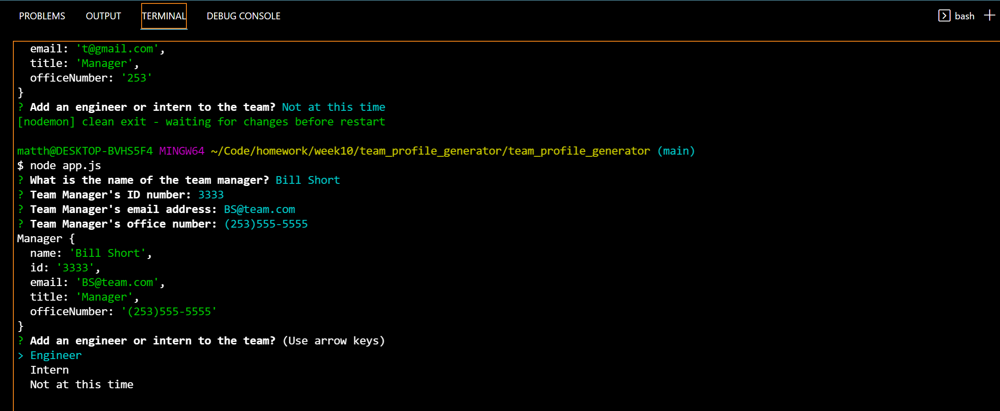
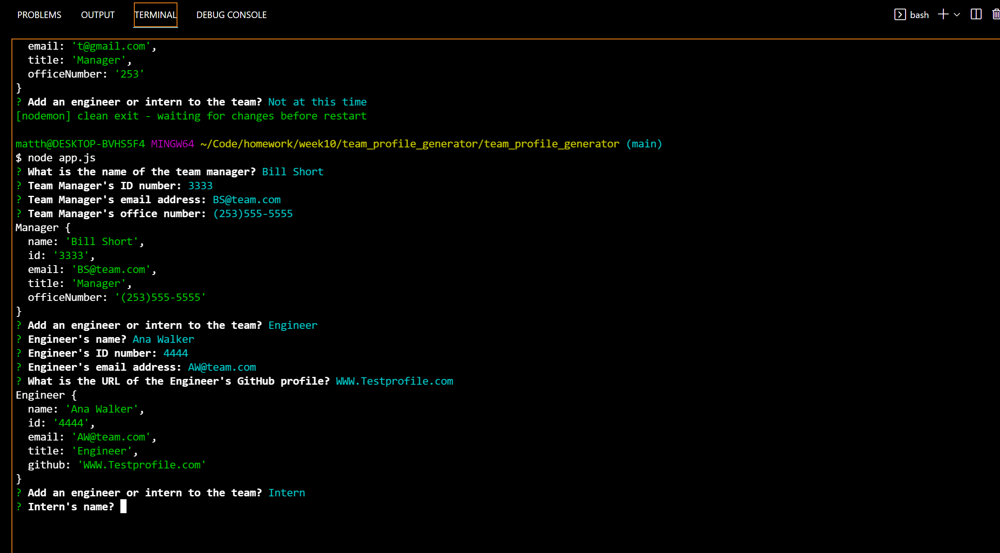

# Team Profile Generator

 

### About

A command-line program for software engineering teams. The user will be prompted for information on the team manager, followed by information on the team members. Any number of team members may be entered, and they can be a mix of engineers and interns. After that, an html page is formed that can be accessed in a web browser with ease.

### Visuals:

### User Video:
[App Demo Video](https://youtu.be/woVR-an5L24)

## Questions
*For any additional information find me at* 

GitHub: [@Matthewwalker333](https://github.com/Matthewwalker333/)

Email: [matthewwalkermw64@gmail.com](mailto:matthewwalkermw64@gmail.com)
